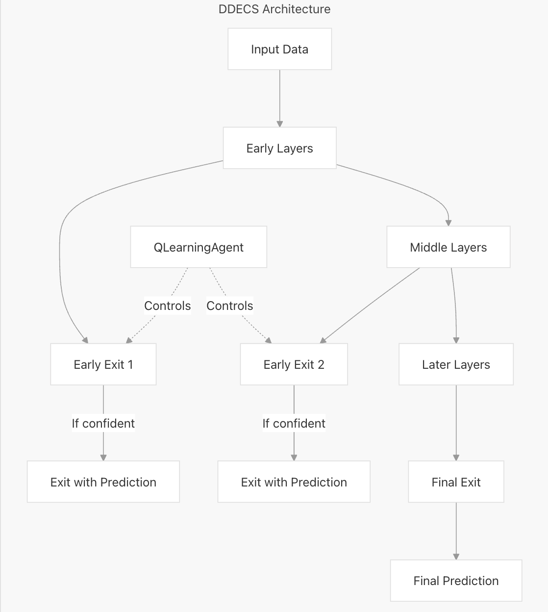

# DDECS - Dynamic DNN Early Exit Exploration

Deep neural networks achieve state-of-the-art performance in many tasks by extracting increasingly high-level features at deeper layers. However, the added depth often comes with higher latency and energy usage during inference—prohibitive for real-time or energy-constrained applications. To address these challenges, our framework integrates **Reinforcement Learning (RL)** with **BranchyNet-inspired** side branches, allowing high-confidence samples to exit early while only complex cases propagate to deeper layers.

## Architecture Overview



*Figure 1: Architecture Overview - A dynamic early-exit DNN with multiple side branches. Each branch can make predictions, and a reinforcement learning agent dynamically decides whether to exit at each branch based on prediction confidence and system constraints.*

This repository contains code to reproduce results from our paper *“RL-Agent-based Early-Exit DNN Architecture Search Framework,”* which demonstrates how dynamically optimized early exits can deliver significant inference speedups (up to 69.7×) and reduce power consumption, all while maintaining accuracy within 1–2% of a static network baseline.

---

## Citation

If you use this codebase or build upon our RL-based early-exit approach, please cite:

```bibtex
@INPROCEEDINGS{11006795,
  author={Taheri, Mahdi and Patne, Parth and Cherezova, Natalia and Mahani, Ali and Herglotz, Christian and Jenihhin, Maksim},
  booktitle={2025 IEEE 28th International Symposium on Design and Diagnostics of Electronic Circuits and Systems (DDECS)}, 
  title={RL-Agent-based Early-Exit DNN Architecture Search Framework}, 
  year={2025},
  pages={145-148},
  keywords={Training;Energy consumption;Accuracy;Power demand;Artificial neural networks;Reinforcement learning;Benchmark testing;Dynamic scheduling;Real-time systems;Optimization;deep neural networks;dynamic DNNs;early exit},
  doi={10.1109/DDECS63720.2025.11006795}
}
```

## Requirements

- A machine with a decent GPU (optional but recommended)
- Python ≥3.7 (tested with Python 3.8/3.9)
- Dependencies listed in requirements.txt (e.g., PyTorch, pynvml, etc.)


### Python Dependencies

- [PyTorch](https://pytorch.org/) (≥1.7)
- `numpy`, `pandas`, `matplotlib`, `scikit-learn`, `seaborn`, etc.
- `pynvml` for GPU power monitoring

Install everything with:

```bash
pip install -r requirements.txt
```

## Quickstart
1. Clone and Set Up
```bash
git clone https://github.com/YourUsername/DDECS-Dynamic-DNN-early-exit-exploration.git
cd DDECS-Dynamic-DNN-early-exit-exploration
pip install -r requirements.txt
```
2. Run Training & Evaluation 
```bash
python dynamic-alexnet-2-early-exits.py 
```
This script trains a 2-exit AlexNet model with RL-based thresholding on the CIFAR-10 dataset.


## Contact

For questions, please create an issue in the repository or reach out at parth.patne123@gmail.com


